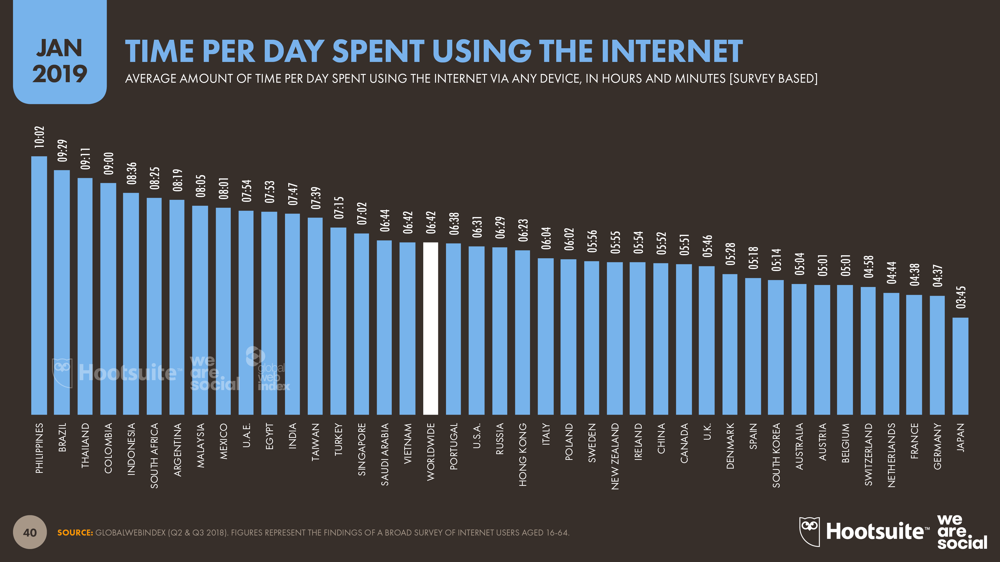
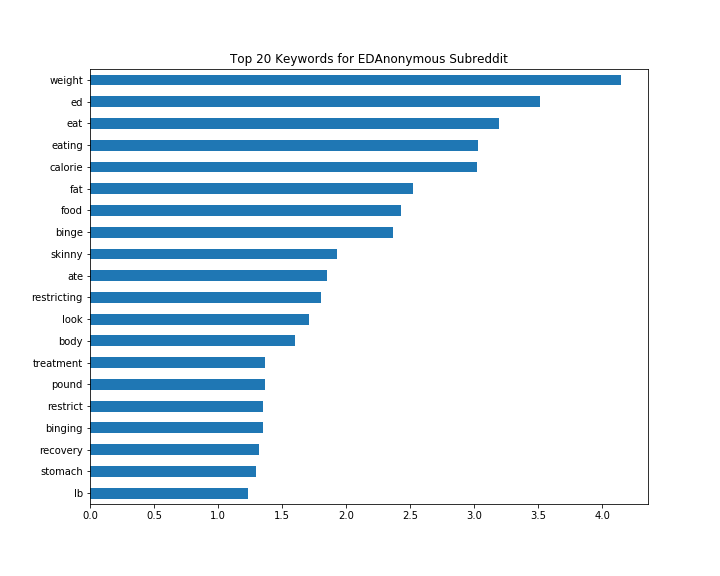
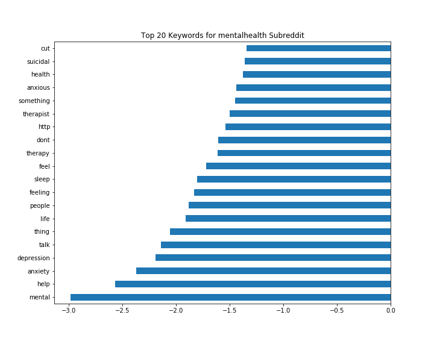

# Predicting Sub-Reddit's through Classification Modelling

A classification model will be trained to identify and classify different posts to the correct Subreddit.

## File list

code
- Scrapping data from 2 Subreddit   
    - Scrapping Subreddits in json file and put them into a dataframe      
- Data Cleaning and Modeling
    - Cleaning dataframe and developing the model   

datasets
- train_ed
    - EDAnonymous dataframe (before cleaning)
- train_mh
    - mentalhealth dataframe (before cleaning)

img
- ed_wordcloud
- mh_wordcloud
- keyword_ed
- keyword_mh
- Time_Internet_2019

## EDA, Data Cleaning & Exploratory Visualizations
- All duplicated data were removed from the dataframe
- Selected the necessary columns for our model
- Both dataframes were then merged into one
- Word cloud was displayed to show a rough gauge of our prominent words

## Modeling
- Logistic Regression and Naive Bayes were used
    - With Count Vectorizer and TFIDF Vectorizer
    - Best parameters were chosen using Gridsearch

## Executive Summary
On Average, most people spent about 7 hours online, if you are one of them chances are you’ve heard of Reddit. The site bills itself as the “front page of the internet,” and ranked at 18th for most-popular sites worldwide. Reddit is broken up into more than a million communities known as “subreddits,” each of which covers a different topic. They are subsidiary threads or categories within the Reddit website.

Subreddits allow users to focus on a specific interest or topic in posting content that gets voted up or down by relevance and user preference. As mentioned earlier, there are more than a million Subreddits which means there are many Subreddits with similar contents, users especially those who are new to Reddit gets confused as to which Subreddit they can post to.

The aim is to identify and classify different posts to the correct Subreddit to make Reddit more user-friendly by helping them find their desired subreddit with less hassle, especially to users who are new to Reddit.

The Logistic Regression model with TFIDF Vectorizer has been proven to perform very well on unseen data with an accuracy percentage of 90.54%. With only 21 false negatives and 16 false positives out of the 391 unseen data. The Logistic approach gets the coefficients that estimate how the independent variables(text features) affect the dependent variable(correct Subreddit).

Below are the top keywords for both Subreddits:
- Posts with keywords like 'weight', 'ed', 'eat'/'eating', 'calorie', 'fat', 'food', 'binge' are more likely to be classified into EDAnonymous Subreddit

- Posts with keywords like 'mental', 'help', 'anxiety', 'depression', 'talk', 'life', 'people', 'feeling' are more likely to be classified into mentalhealth Subreddit

Recommendation: This model can be further modified with more Subreddits to recommend different Subreddits with similar topics for users to look at and choose from to further ease the problems of being unfamiliar with the different types of similar Subreddits.
